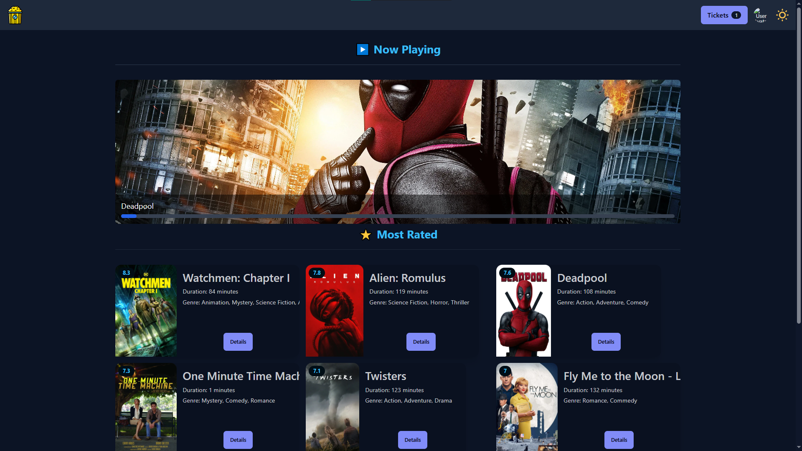

# Cineaura

Cineaura is a full-stack website for managing cinemas, featuring an authentication and booking system.

## [Live Demo](https://picred.github.io/cineaura/)

## Preview


## Description

The Cineaura website offers several features, including:

- **User Authentication**: Registration and login for users/admins.
- **Ticket Booking**: System for selecting movies and showtimes.
- **Movie Listings**: Display of available movies with details like plot, cast, and ratings.

## Requirements

To run the project, make sure you have the following prerequisites:

- Node.js \[[Guide NVM](https://www.freecodecamp.org/news/node-version-manager-nvm-install-guide/)\]

## Installation

1. Clone the repository:

```bash
git clone https://github.com/Picred/cineaura.git
cd cineaura
```

2. Install the dependencies for both backend and frontend:

```bash
# Backend
cd backend
npm install

# Frontend
cd ../frontend
npm install
```

> The database is managed via **SQLite**. You don't need to install or configure any external database server like MySQL. The schema and seed data are initialized automatically on the first run of the backend.

## Local Development

To run the project locally with hot-reloading:

1. **Start the Backend**:
   ```bash
   cd backend
   npm run dev
   ```
   The backend will run on `http://localhost:8080`. On start, it will create/update `src/db/database.sqlite`.

2. **Start the Frontend**:
   ```bash
   cd frontend
   npm run dev
   ```
   The frontend will run on `http://localhost:5173`. It is configured to proxy API requests to the backend.

## Production Run

If you want to run the production build:

1. **Build the frontend**:
   ```bash
   cd frontend
   npm run build
   ```
   This will generate the static files in `../backend/public`.

2. **Start the server**:
   ```bash
   cd backend
   npm start
   ```
   Access the website at `http://localhost:8080`.

